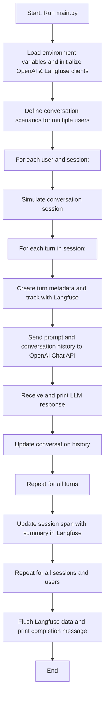
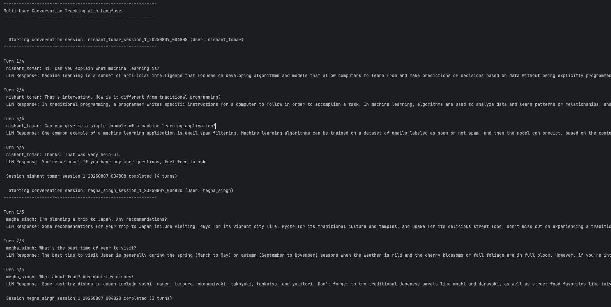

# Langfuse Multi-Chat Tracker

A Python project to simulate and track multi-user, multi-session conversations with OpenAI's GPT models, using Langfuse for advanced observability and analytics.

## Features
- Tracks multiple users and sessions
- Logs each conversation turn and session in Langfuse
- Supports OpenAI GPT-3.5/4 models
- Provides session and turn-level metadata
- Includes example scenarios for demo/testing

## Project Structure
- `main.py`: Main script for running and tracking conversations
- `assets/`: Contains screenshots and output samples
- `.env`: Store your API keys (not included)

## How It Works
1. Loads environment variables and initializes OpenAI & Langfuse clients
2. Defines conversation scenarios for multiple users
3. For each user/session, simulates a conversation:
    - Each turn is tracked with metadata in Langfuse
    - Prompts and responses are sent to OpenAI and logged
    - Session and turn-level analytics are available in Langfuse dashboard

## Flowchart


## Screenshots

Below are some screenshots from the `assets/` folder demonstrating the project in action:




## Requirements
- Python 3.8+
- `openai`, `langfuse`, `python-dotenv`

Install dependencies:
```bash
pip install -r requirements.txt
```

## Usage
1. Set your OpenAI and Langfuse API keys in a `.env` file:
   ```env
   OPENAI_API_KEY=your_openai_key
   LANGFUSE_PUBLIC_KEY=your_langfuse_public_key
   LANGFUSE_SECRET_KEY=your_langfuse_secret_key
   LANGFUSE_HOST=https://cloud.langfuse.com
   ```
2. Run the main script:
   ```bash
   python main.py
   ```
3. View analytics and traces in your Langfuse dashboard.

## License

This project is licensed under the MIT License. See the [LICENSE](LICENSE) file for details.
